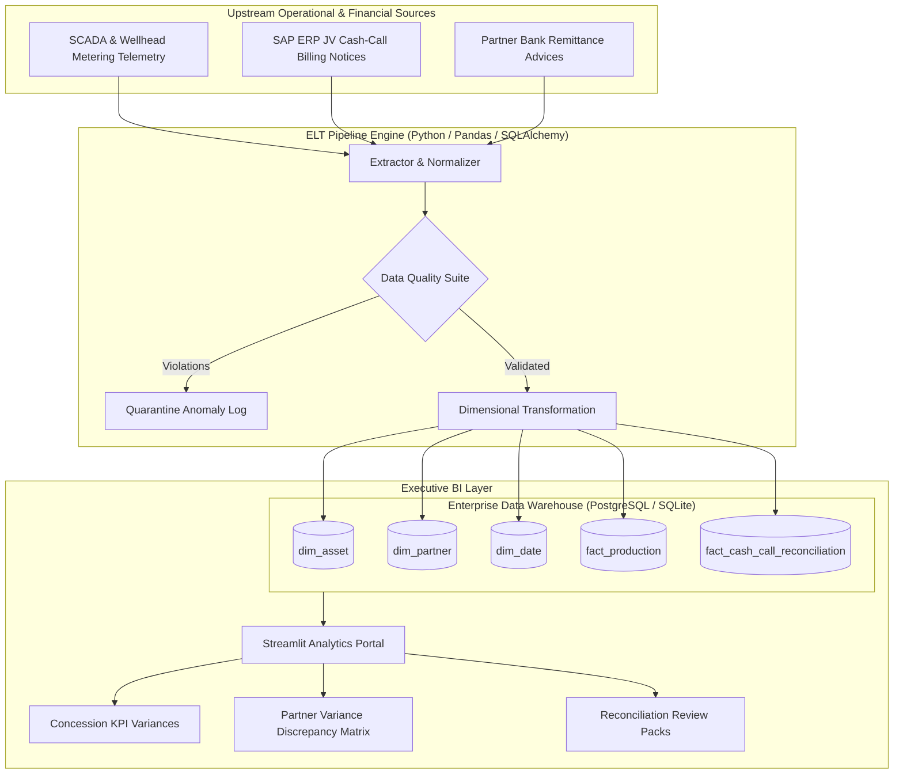

# Upstream Energy Enterprise Data Warehouse (EDW) & JV Cash-Call Analytics

[](https://www.python.org/)
[](https://www.sqlalchemy.org/)
[](https://www.postgresql.org/)
[](https://streamlit.io/)
[](https://www.docker.com/)
[](LICENSE)
[](https://github.com/JayNabasu)

An end-to-end Enterprise Data Warehouse (EDW) and operational analytics platform modeling upstream oil & gas telemetry across multi-terrain operating concessions (deepwater, swamp, and onshore), automating Joint Venture (JV) cash-call financial reconciliations, and enforcing strict data quality contracts.

---

## Architectural Highlights

- **Star Schema Dimensional Modeling**: Conformed dimensions (`dim_asset`, `dim_partner`, `dim_date`) joined to grain-level facts (`fact_production` for daily telemetry and `fact_cash_call_reconciliation` for partner billings and remittances).
- **Automated Data Quality & Contracts**: Assertion suite validating physical volumetric bounds (water-cut percentages, conservation of liquids law: Gross = Net Crude + Water) and financial parity (`Total Billed = CAPEX + OPEX`).
- **JV Cash-Call Billing & Reconciliation Engine**: Reconciles monthly cash-call commitments against partner disbursements, detecting under/over-funding variances for executive review.
- **Interactive Streamlit Executive Portal**: Real-time KPI tracking, interactive asset variance exploration vs AOP (Annual Operating Plan) targets, and one-click reconciliation audit pack exports.
- **Production Containerization**: Multi-container `docker-compose` orchestration supporting PostgreSQL 16, automated ELT migration worker, and web dashboard.

---

## Architecture & Data Flow



---

## Repository Structure

```text
energy-edw-pipeline-analytics/
├── edw_core/
│   ├── models.py                  # SQLAlchemy Star Schema models
│   └── extractors.py              # Telemetry & JV billing generators
├── data_quality/
│   └── assertions.py              # Automated data assertions & contract suite
├── dashboard/
│   └── app.py                     # Interactive Streamlit executive dashboard
├── tests/
│   └── test_pipeline.py           # pytest automated validation suite
├── pipeline_runner.py             # End-to-end ELT orchestration script
├── docker-compose.yml             # Container orchestration (PostgreSQL + Dashboard)
├── Dockerfile                     # Container definition
├── requirements.txt               # Dependencies
├── .gitignore
└── README.md
```

---

## Quick Start Guide

### 1. Local Python Environment Setup
```powershell
# Clone the repository
git clone https://github.com/JayNabasu/energy-edw-pipeline-analytics.git
cd energy-edw-pipeline-analytics

# Install dependencies
pip install -r requirements.txt
```

### 2. Execute the ELT Pipeline
Runs dimensional seeding, ingestion, data quality assertions, and populates the star schema warehouse:
```powershell
python pipeline_runner.py
```

### 3. Run Automated Tests
```powershell
python -m pytest tests/test_pipeline.py
```

### 4. Launch the Executive Dashboard
```powershell
streamlit run dashboard/app.py
```
Open `http://localhost:8501` in your browser to explore asset telemetry, water-cut trends, and partner cash-call reconciliation matrices.

### 5. Run with Docker Compose (PostgreSQL)
```powershell
docker-compose up --build
```

---

## Author & Contact

**Jerry A. Nabasu**  
- **Role**: Automation & Digital Innovation Professional  
- **Directorate**: Research, Technology & Innovation (RTI), NNPC Limited  
- **GitHub**: [@JayNabasu](https://github.com/JayNabasu)  
- **Email**: [jerrynabasu@gmail.com](mailto:jerrynabasu@gmail.com)
